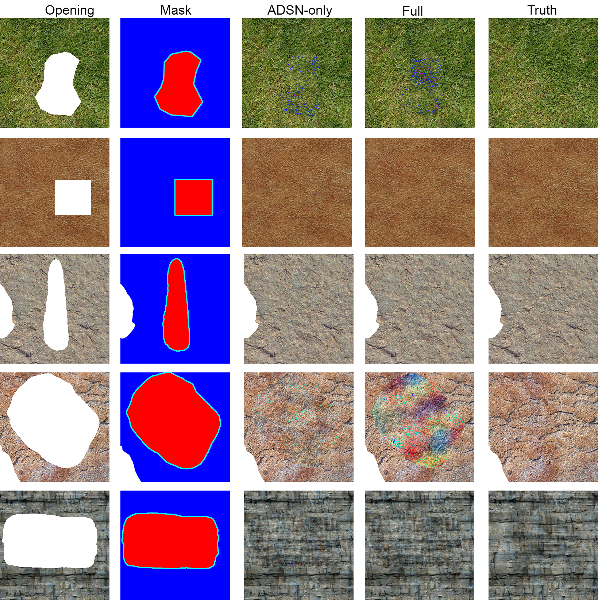
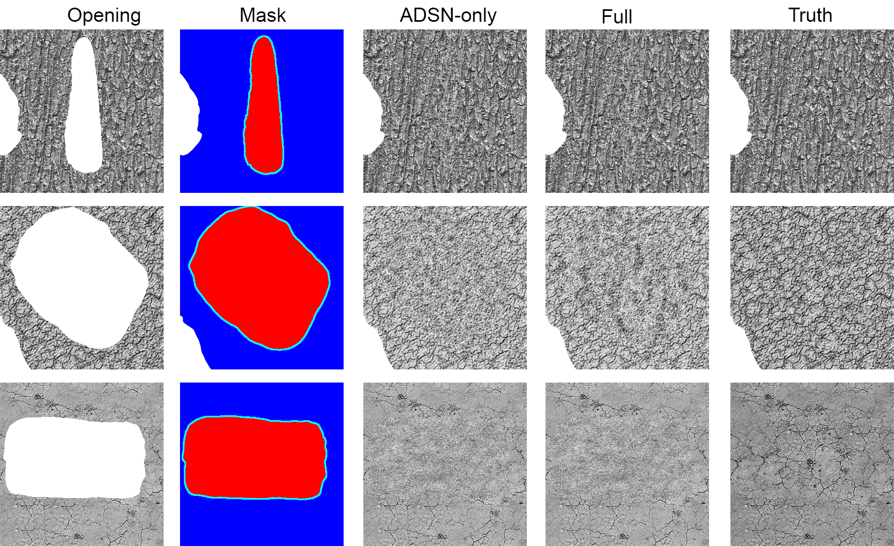

# Pythonic implementation of Gaussian Texture Inpainting
A tool for image reparation and inpainting using Gaussian Conditional Simulation. Implementation of the research paper, [Texture Inpainting Using Efficient Gaussian Conditional Simulation, Bruno Galerne, Arthur Leclaire](https://hal.archives-ouvertes.fr/hal-01428428/document).

Development:
[Penelope Tay](https://github.com/Ozeuth)
Special Thanks:
[Gautier LOVEIKO](https://github.com/salimandre) for discussing his [implementation](https://github.com/salimandre/texture-inpainting).
[Au Khai Xiang](https://kx-au.github.io/) for providing mathematical insight.

## Description
This tool lets you repair 2D images with missing, damaged or undesirable areas. Such areas are filled with coherent, context-aware new content in order to produce a repaired image.

## Results (Microtextures)

## Results (Height maps)

## Development
### Current Progress: Complete with Maintenance
Feel free to [contact me](mailto:ozeuthgatum@gmail.com) if you have any problems using the 2D Inpainter, or if you'd like to report a bug.

## Usage
1. Put the images you wish to repair into the "demo_inpaint" folder.
  - Give them the shared suffix, "opening" (e.g., `demo_inpaint\1_opening.png`)
2. Create masks for the images.
  - Masks should hold information as follows,
    Red area = area you wish to inpaint
    Cyan (green+blue) area = conditioning area. If in doubt, set it to a 3 pixel border around the red area
    blue area = remaining known area
3. Put the masks into the "demo_inpaint" folder
  - Give them the shared suffix, "mcw" (e.g., `demo_inpaint\1_mcw.png`)
3. Simply run:
        python repair_2d.py
Gaussian inpainting will produce 2 images with suffix "F_result.png" and "full_result.png". These refer to the ADSN-only and ADSN+Kriging+Innovation inpainting results respectively.
